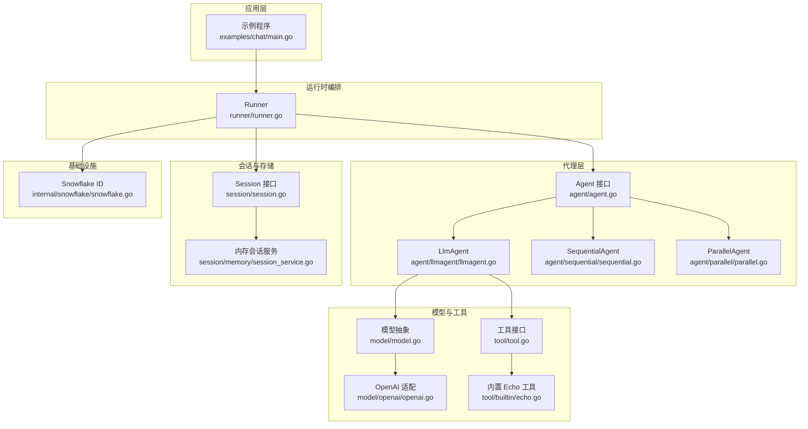
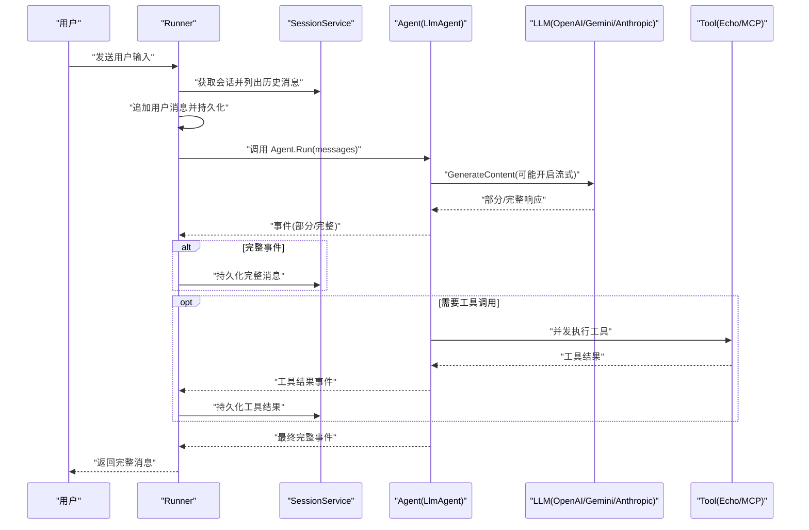
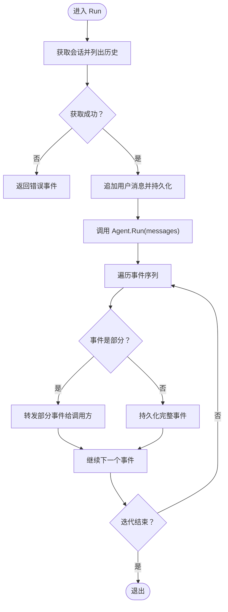
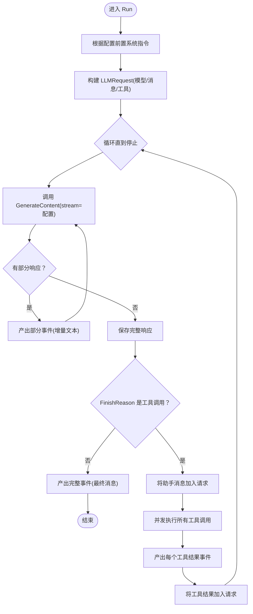
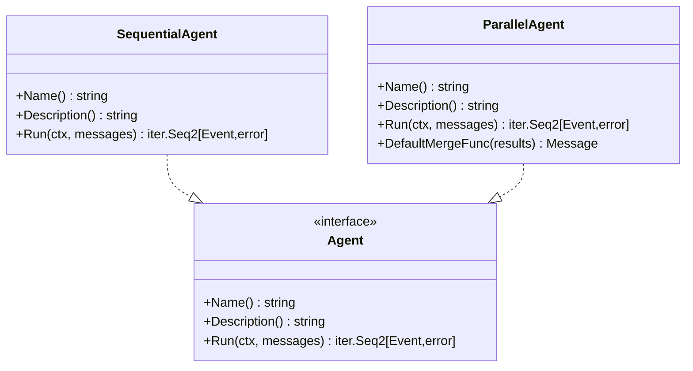
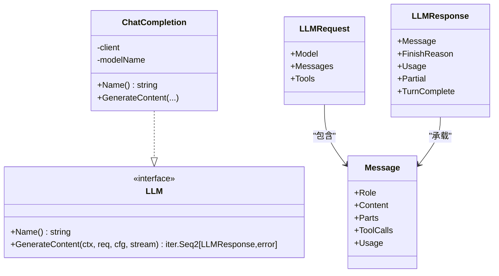
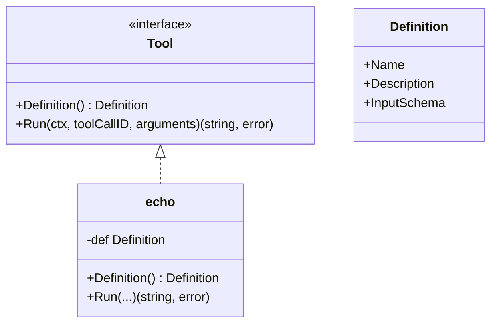
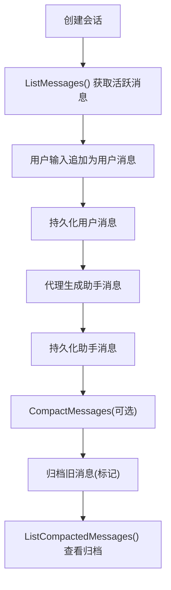
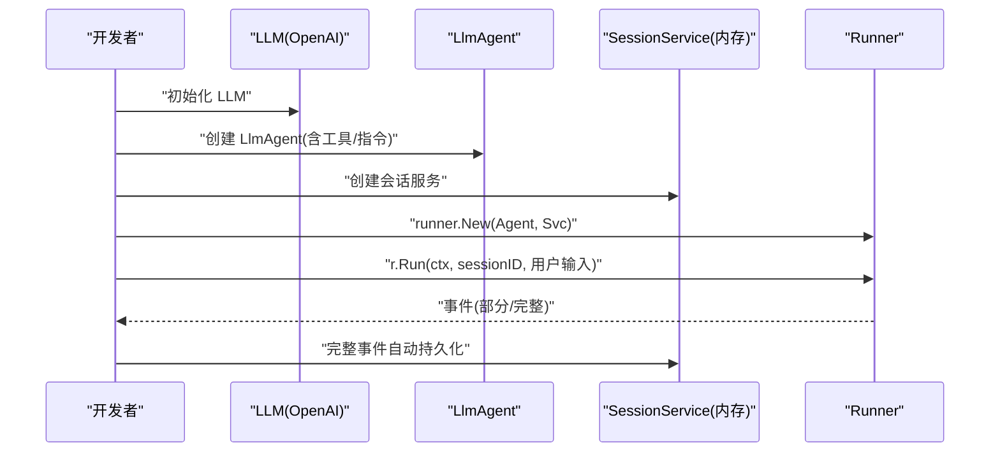
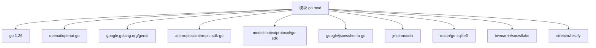

# 项目概述

<cite>
**本文引用的文件**
- [README.md](file://README.md)
- [go.mod](file://go.mod)
- [agent/agent.go](file://agent/agent.go)
- [runner/runner.go](file://runner/runner.go)
- [model/model.go](file://model/model.go)
- [agent/llmagent/llmagent.go](file://agent/llmagent/llmagent.go)
- [examples/chat/main.go](file://examples/chat/main.go)
- [tool/tool.go](file://tool/tool.go)
- [session/session.go](file://session/session.go)
- [model/openai/openai.go](file://model/openai/openai.go)
- [agent/sequential/sequential.go](file://agent/sequential/sequential.go)
- [agent/parallel/parallel.go](file://agent/parallel/parallel.go)
- [tool/builtin/echo.go](file://tool/builtin/echo.go)
- [session/memory/session_service.go](file://session/memory/session_service.go)
- [internal/snowflake/snowflake.go](file://internal/snowflake/snowflake.go)
</cite>

## 目录
1. [引言](#引言)
2. [项目结构](#项目结构)
3. [核心组件](#核心组件)
4. [架构总览](#架构总览)
5. [详细组件分析](#详细组件分析)
6. [依赖分析](#依赖分析)
7. [性能考虑](#性能考虑)
8. [故障排查指南](#故障排查指南)
9. [结论](#结论)
10. [附录](#附录)

## 引言
ADK 是一个轻量级、符合 Go 语言习惯的 AI 代理开发框架，专注于“无状态代理 + 有状态运行器”的分离设计，提供供应商无关的 LLM 接口、自动工具调用循环、代理组合（串行/并行）、MCP 工具集成、消息历史软归档与 Snowflake 分布式 ID 等能力。它通过模块化包布局与清晰的接口契约，帮助你在 3 分钟内搭建第一个可流式的 AI 代理应用。

- 轻量级 Go 库：以最小依赖实现最大灵活性，适合生产就绪场景
- 无状态代理 + 有状态运行器：职责清晰，便于测试、扩展与复用
- 供应商无关：统一抽象适配 OpenAI、Gemini、Anthropic 等
- 自动工具调用循环：LLM 请求 → 工具执行 → 结果回写，直至停止
- 代理组合：顺序流水线与并行集合，满足复杂工作流
- 流式输出：原生 Go 迭代器支持增量文本输出
- 消息历史管理：软归档旧消息，保留上下文可追溯

## 项目结构
ADK 采用按职责分层的包布局，核心目录与职责如下：
- agent：定义 Agent 接口及具体实现（LLM 驱动、串行/并行组合、将 Agent 当工具使用）
- model：LLM 抽象、消息类型、生成配置、事件模型
- session：会话与消息持久化接口与内存/数据库实现
- tool：工具接口、内置工具与 MCP 工具桥接
- runner：协调 Agent 与 SessionService，驱动一次用户回合
- internal：内部工具（如 Snowflake ID 生成）

图表来源
- [runner/runner.go:17-96](file://runner/runner.go#L17-L96)
- [agent/agent.go:10-19](file://agent/agent.go#L10-L19)
- [agent/llmagent/llmagent.go:30-136](file://agent/llmagent/llmagent.go#L30-L136)
- [agent/sequential/sequential.go:18-92](file://agent/sequential/sequential.go#L18-L92)
- [agent/parallel/parallel.go:70-174](file://agent/parallel/parallel.go#L70-L174)
- [model/model.go:10-227](file://model/model.go#L10-L227)
- [model/openai/openai.go:19-164](file://model/openai/openai.go#L19-L164)
- [tool/tool.go:9-23](file://tool/tool.go#L9-L23)
- [tool/builtin/echo.go:14-46](file://tool/builtin/echo.go#L14-L46)
- [session/session.go:9-23](file://session/session.go#L9-L23)
- [session/memory/session_service.go:10-40](file://session/memory/session_service.go#L10-L40)
- [internal/snowflake/snowflake.go:17-56](file://internal/snowflake/snowflake.go#L17-L56)

章节来源
- [README.md:67-89](file://README.md#L67-L89)
- [go.mod:1-47](file://go.mod#L1-L47)

## 核心组件
- Agent 接口：定义 Run 方法，返回 Go 迭代器，逐个产出事件（部分/完整），支持实时流式显示
- LlmAgent：基于配置驱动的无状态代理，自动处理工具调用循环，支持并发工具执行
- Runner：有状态运行器，负责加载/保存会话、驱动代理、分配 Snowflake ID、区分部分/完整事件
- 模型抽象：统一 LLM 接口、消息类型、生成配置、事件模型；支持多模态输入
- 工具系统：统一工具接口与 JSON Schema 定义，内置 Echo 工具，支持 MCP 服务器桥接
- 会话系统：Session/SessionService 接口，内存与 SQLite 后端，支持消息软归档
- Snowflake ID：分布式、时间有序的消息标识符生成

章节来源
- [agent/agent.go:10-19](file://agent/agent.go#L10-L19)
- [agent/llmagent/llmagent.go:30-136](file://agent/llmagent/llmagent.go#L30-L136)
- [runner/runner.go:17-107](file://runner/runner.go#L17-L107)
- [model/model.go:10-227](file://model/model.go#L10-L227)
- [tool/tool.go:9-23](file://tool/tool.go#L9-L23)
- [session/session.go:9-23](file://session/session.go#L9-L23)
- [internal/snowflake/snowflake.go:17-56](file://internal/snowflake/snowflake.go#L17-L56)

## 架构总览
ADK 的核心设计是“无状态代理 + 有状态运行器”分离：
- 运行器（Runner）持有会话服务，加载历史消息，追加用户输入，调用代理，仅在完整事件时持久化
- 代理（Agent）只关注当前回合的消息与工具调用，不感知历史或存储
- LlmAgent 在每次生成后检查是否需要工具调用，若需则并发执行工具并回写结果，直到模型决定停止

图表来源
- [runner/runner.go:39-96](file://runner/runner.go#L39-L96)
- [agent/llmagent/llmagent.go:56-136](file://agent/llmagent/llmagent.go#L56-L136)
- [model/openai/openai.go:44-164](file://model/openai/openai.go#L44-L164)
- [tool/builtin/echo.go:40-46](file://tool/builtin/echo.go#L40-L46)

## 详细组件分析

### Runner 组件
- 职责：加载会话、追加用户输入、调用代理、区分部分/完整事件、持久化完整消息、分配 Snowflake ID
- 关键点：仅在完整事件时持久化；部分事件用于实时流式显示；错误传播到调用方

图表来源
- [runner/runner.go:39-96](file://runner/runner.go#L39-L96)
- [runner/runner.go:98-107](file://runner/runner.go#L98-L107)

章节来源
- [runner/runner.go:17-107](file://runner/runner.go#L17-L107)

### LlmAgent 组件
- 职责：在每次生成后检查完成原因；若为工具调用，则并发执行工具并将结果回写；支持流式输出
- 关键点：并发工具执行保持原始顺序；将使用量附加到助手消息；支持指令前置系统消息

图表来源
- [agent/llmagent/llmagent.go:56-136](file://agent/llmagent/llmagent.go#L56-L136)

章节来源
- [agent/llmagent/llmagent.go:14-46](file://agent/llmagent/llmagent.go#L14-L46)
- [agent/llmagent/llmagent.go:138-159](file://agent/llmagent/llmagent.go#L138-L159)

### 代理组合（Sequential/Parallel）
- 顺序代理：将多个代理串联，每个代理看到“原始输入 + 前序所有完整消息”，中间注入手过户消息以满足 LLM 对话期望
- 并行代理：并发启动多个代理，收集各自完整消息后合并为单条助手消息，支持自定义合并函数

图表来源
- [agent/sequential/sequential.go:18-92](file://agent/sequential/sequential.go#L18-L92)
- [agent/parallel/parallel.go:70-174](file://agent/parallel/parallel.go#L70-L174)
- [agent/agent.go:10-19](file://agent/agent.go#L10-L19)

章节来源
- [agent/sequential/sequential.go:18-92](file://agent/sequential/sequential.go#L18-L92)
- [agent/parallel/parallel.go:70-174](file://agent/parallel/parallel.go#L70-L174)

### 模型抽象与 OpenAI 适配
- 模型抽象：统一 LLM 接口、消息类型、生成配置、事件模型；支持多模态内容（文本/图片）、工具调用、思考内容、Token 使用统计
- OpenAI 适配：将模型消息、工具定义映射到 OpenAI 参数，支持流式与非流式两种模式；将响应转换为统一模型对象

图表来源
- [model/model.go:10-227](file://model/model.go#L10-L227)
- [model/openai/openai.go:19-164](file://model/openai/openai.go#L19-L164)

章节来源
- [model/model.go:10-227](file://model/model.go#L10-L227)
- [model/openai/openai.go:19-164](file://model/openai/openai.go#L19-L164)

### 工具系统与内置 Echo
- 工具接口：Definition 描述工具元数据（名称、描述、输入 JSON Schema），Run 执行工具并返回字符串结果
- 内置 Echo：演示如何生成 JSON Schema 并实现工具定义与执行

图表来源
- [tool/tool.go:9-23](file://tool/tool.go#L9-L23)
- [tool/builtin/echo.go:14-46](file://tool/builtin/echo.go#L14-L46)

章节来源
- [tool/tool.go:9-23](file://tool/tool.go#L9-L23)
- [tool/builtin/echo.go:14-46](file://tool/builtin/echo.go#L14-L46)

### 会话与消息管理
- Session 接口：提供会话生命周期管理、消息列表、软归档、删除等能力
- 内存会话服务：零配置、进程内使用；适合测试与单进程场景
- 消息软归档：将旧消息标记为已归档而非物理删除，支持摘要归并

图表来源
- [session/session.go:9-23](file://session/session.go#L9-L23)
- [session/memory/session_service.go:18-40](file://session/memory/session_service.go#L18-L40)
- [README.md:248-266](file://README.md#L248-L266)

章节来源
- [session/session.go:9-23](file://session/session.go#L9-L23)
- [session/memory/session_service.go:10-40](file://session/memory/session_service.go#L10-L40)
- [README.md:248-266](file://README.md#L248-L266)

### 快速开始（3 分钟搭建）
- 步骤概览
  1) 创建 LLM（OpenAI/Gemini/Anthropic）
  2) 构建 LlmAgent（可选工具、指令、流式）
  3) 选择会话后端（内存/SQLite）
  4) 创建 Runner 并运行一次用户回合，迭代事件进行流式输出与持久化

图表来源
- [README.md:92-186](file://README.md#L92-L186)
- [examples/chat/main.go:52-177](file://examples/chat/main.go#L52-L177)

章节来源
- [README.md:92-186](file://README.md#L92-L186)
- [examples/chat/main.go:52-177](file://examples/chat/main.go#L52-L177)

## 依赖分析
- Go 版本：1.26+
- 外部依赖（节选）：OpenAI SDK、Gemini SDK、Anthropic SDK、MCP SDK、JSON Schema、SQLite 驱动、Snowflake、Testify
- 依赖特点：按需引入，避免不必要的耦合；模型与工具适配器独立于核心逻辑

图表来源
- [go.mod:3-15](file://go.mod#L3-L15)

章节来源
- [go.mod:1-47](file://go.mod#L1-L47)

## 性能考虑
- 流式输出：通过 Go 迭代器实现增量文本传输，降低延迟，提升交互体验
- 并发工具执行：在工具调用阶段使用 goroutine 并发执行，缩短总等待时间
- 会话软归档：避免全量删除带来的 IO 压力，结合摘要归并控制历史规模
- ID 分布式：Snowflake 时间有序 ID，便于跨节点排序与去重

## 故障排查指南
- 无法连接外部 LLM：检查 API Key、Base URL、网络连通性；确认模型名称正确
- 工具未找到：确保工具定义名称与 LLM 请求一致；检查工具注册映射
- 会话持久化失败：确认会话服务可用、数据库驱动可用（SQLite）、权限足够
- 流式输出中断：检查上游适配器的流式实现与网络稳定性
- 并发工具报错：并行代理会在首个错误发生时取消上下文，尽快让其他子任务退出

章节来源
- [agent/llmagent/llmagent.go:138-159](file://agent/llmagent/llmagent.go#L138-L159)
- [runner/runner.go:98-107](file://runner/runner.go#L98-L107)
- [model/openai/openai.go:44-164](file://model/openai/openai.go#L44-L164)

## 结论
ADK 以清晰的接口与模块化设计，将“无状态代理 + 有状态运行器”解耦，使你可以在不修改代理代码的前提下切换 LLM 提供商、接入任意工具源（内置/自定义/MCP），并通过串行/并行组合构建复杂工作流。配合流式输出、消息软归档与分布式 ID，ADK 能够在保证可维护性的同时，满足生产环境对性能与可扩展性的要求。

## 附录
- 安装与版本
  - 模块路径：soasurs.dev/soasurs/adk
  - Go 版本：1.26+
- 许可证：Apache 2.0

章节来源
- [README.md:9-11](file://README.md#L9-L11)
- [README.md:396-399](file://README.md#L396-L399)
- [go.mod:3](file://go.mod#L3)